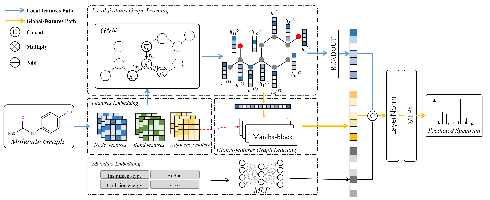

# GNN-Mamba: A Graph-Aware Selective State Space Model for MS/MS Spectrum Prediction in Metabolite Identification

## Overview

GNN-Mamba is a novel spectral prediction framework that effectively alleviates the capability bottlenecks of existing methods in characterizing complex molecular fragmentation pathways by integrating local atomic chemical environments with global molecular topological information. 


> **Fig. 1** | Framework of the GNN-Mamba Spectrum Prediction Model.


---

## Requirements

To run this project, ensure your system meets the following specifications:

* **Operating System:** Windows / Linux (highly recommended)
* **Python:** 3.8
* **PyTorch:** 1.12.1
* **CUDA:** 11.6

---

## Installation

The required environment can be easily set up using Conda. Please follow the steps below:

```bash
# 1. Clone the repository
git clone [https://github.com/yourusername/GNN-Mamba.git](https://github.com/yourusername/GNN-Mamba.git)
cd GNN-Mamba

# 2. Create the conda environment from the provided configuration file
conda env create -f environment.yml

# 3. Activate the environment
conda activate GNN-Mamba
